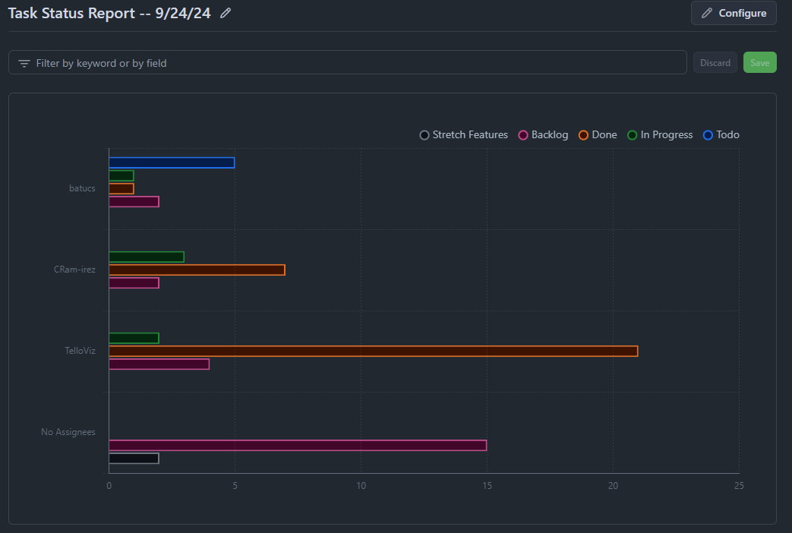

# Meeting Notes for Software Engineering Group Project

**Date:** 9/24/24 \
**Attendees:** Christian, Josh \
**Absent:** Batu 

## Agenda

1. **Version 0.1 Prototype Discussion**
   - Discussed features to be included in the demo for Thursday.
   - Clarified what will **not** be included in this version.

2. **Aspect Ratios for Desktop Environment**
   - Explored potential aspect ratios for the program.
   - Analyzed how these ratios will affect layout and feature integration.

3. **Troubleshooting QT Issues**
   - Spent time resolving QT-related problems on Christian's Mac system.

4. **Project Pacing and Process Framework**
   - Discussed project pacing in relation to the process framework we are utilizing.

5. **Group Management Roles**
   - Professor suggested appointing a "Group Manager."
   - Christian will take on this role and maintain reports for the class.
   - Josh will continue as the Lead in development aspects.

## Action Items
- Christian: Troubleshoot and fix QT Mac issues by Thursday.
- Josh: Create a prototype branch on the repo and push the prototype project to that branch.

## Task Status Report Graph 
 

