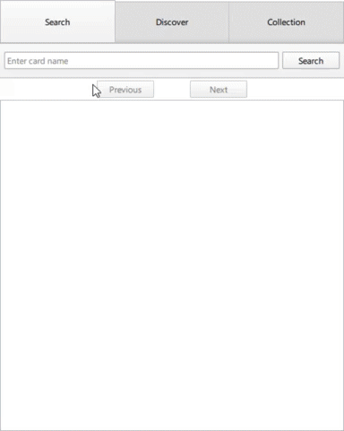
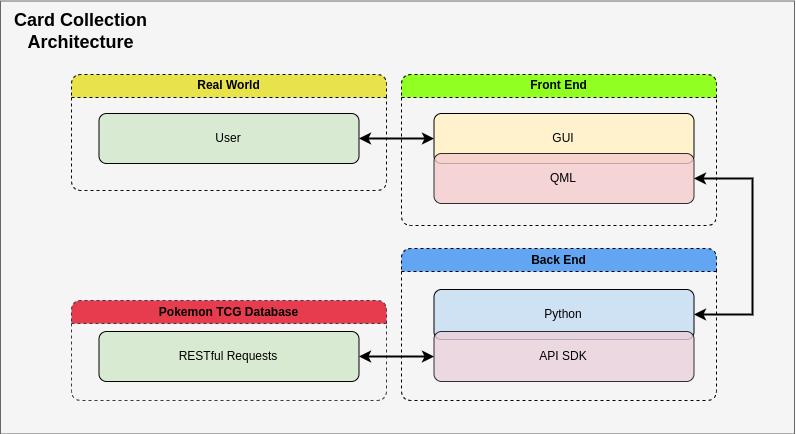

# Card Collection Searching and Tracking

## Project Overview
This project is a desktop application designed for searching, browsing, filtering, and maintaining a collection of trading cards. The project is developed as part of the CPSC 362 Software Engineering course.

## Team Members

| Name             | Role                          |
|------------------|-------------------------------|
| Batu Demirtas    | Developer                     |
| Christian Ramirez| Developer                     |
| Josh Lollis      | Developer                     |

## Technologies Used

- **Languages/Frameworks/Libraries**: 
  - Python
  - REST
  - QT Quick
- **IDEs**:
  - QT Creator
  - VS Code
- **Version Control**:
  - GIT/GitHub

## Project Description
This desktop application provides users with a comprehensive tool for managing their trading card collections. It features a user-friendly interface that allows for easy searching, filtering, and displaying of trading cards. Users will also be able to mark their favorites and view them in their "Collection".

#### See Our Most Recent Progress Reports
- [9/5/24](https://github.com/TelloViz/Card-Collection/discussions/11)
- [9/13/24](https://github.com/TelloViz/Card-Collection/discussions/32)

## Prototype Demo

## Proposed Architecture

## Preliminary GUI Mockup

